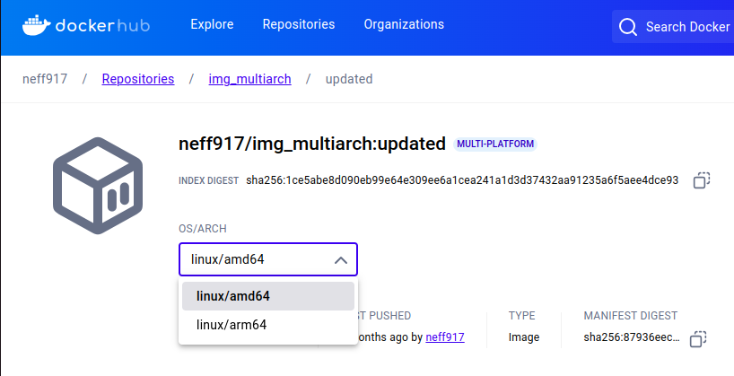

#  Multi-Arch Docker Image

This repository demonstrates how to build *multi-architecture Docker images* that support both *ARM64* and *AMD64* platforms.  
Multi-platform images allow you to run the same Docker image on different hardware types without needing emulation.

---

## Features

- Build Docker images for multiple architectures (*AMD64* and *ARM64*)
- Simplifies deployment on different hardware and cloud platforms
- Uses *Docker Buildx* for advanced multi-platform support
- Includes a *FastAPI demo* for testing image processing with *YOLOv5*

---

## Prerequisites

- *Docker* version ≥ 20.10  
- *Docker Buildx* (included with modern Docker versions)

---
## Repository Structure
```
├── appfast.py          # FastAPI app for YOLOv5 image detection
├── dockerfile          # Docker build instructions
├── requirements.txt    # Python dependencies
├── README.md           # Documentation
└── Published Multi-Arch Image.png

```
---


##  1. Create a Custom Builder

Docker Buildx allows creating a custom builder to enable multi-platform builds.

```bash
# Create and bootstrap a new Buildx builder
docker buildx create \
  --name container-builder \
  --driver docker-container \
  --use --bootstrap
```

---

##  2. Build Multi-Platform Images

 ### Build the Docker image for AMD64 and ARM64 platforms
 ```bash
docker buildx build --platform linux/amd64,linux/arm64 -t your-image-name .
 ```
This command builds an image compatible with both x86_64 and ARM64 platforms.


---

  ### Published Image

You can also pull the prebuilt multi-architecture image from Docker Hub:
 ```bash
docker pull neff917/img_multiarch:updated
 ```

Repository: neff917/img_multiarch:updated
Supported Architectures:

linux/amd64

linux/arm64




---

##  3. Testing with FastAPI


This repository includes a FastAPI server to test the Docker image:

### Run the FastAPI server inside the Docker container
 ```bash
docker run -p 8080:8080 neff917/img_multiarch:updated
```


### Python Dependencies:
torch, fastapi, uvicorn, numpy, PIL


---

### Access the FastAPI Endpoint

You can test the API locally using cURL or Postman:

 ```bash
http://localhost:8080/predict
```


